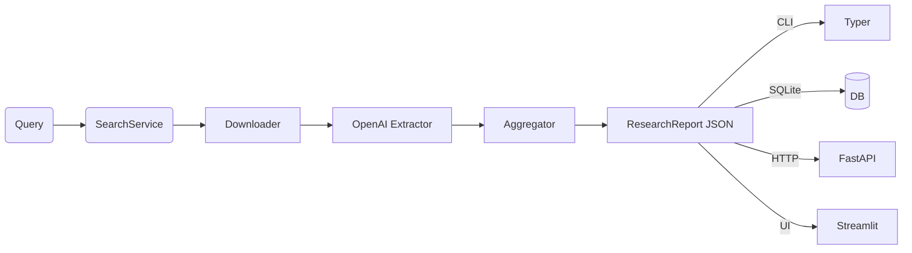

# GTMind — Autonomous Research Agent 🔎

> **From a single query to a structured, source‑linked research report.**  
> Searches the web → cleans articles → extracts insights with GPT‑4o → de‑duplicates & ranks → serves JSON, SQLite, CLI, and a Streamlit UI.

---

## ✨ What's inside?

| Layer | Module | Tech / Libs | Purpose |
|-------|--------|-------------|---------|
| **Search**      | `core/search.py`      | Serper.dev · `httpx`          | Google‑style search → URLs |
| **Parse**       | `core/parse.py`       | Async `httpx` · `trafilatura` | Download & boilerplate‑strip HTML |
| **Extract**     | `core/extract.py`     | OpenAI GPT‑4o · function‑calling | Pull trends, companies, gaps |
| **Aggregate**   | `core/aggregate.py`   | RapidFuzz · frequency rank    | De‑dupe & merge into a report |
| **Persist**     | `persistence.py`      | SQLite · `sqlmodel`           | `--save-sqlite` flag, history sidebar |
| **Serve**       | `api/run.py`          | FastAPI · Typer CLI           | `/report` JSON · `gtmind` CLI cmd |
| **UI**          | `ui/app.py`           | Streamlit                     | Query box, green gaps, saved list |
| **Tooling**     | Ruff · Mypy · Pytest  | 90 %+ coverage, pre‑commit hooks |
| **Deploy**      | Dockerfile            | Uvicorn + Streamlit           | One image → prod‑ready |

---

## 🖼 Architecture



---

## 📋 Requirements

- Python 3.10+
- OpenAI API key
- Serper.dev API key (for Google-style search)
- Poetry (for dependency management)

---

## 🛠️ Installation

### Using Poetry (recommended)

```bash
git clone https://github.com/your-org/gtmind && cd gtmind
make install                                # poetry deps + tools
```

### Manual Installation

```bash
git clone https://github.com/your-org/gtmind && cd gtmind
python -m pip install -e .
```

### Docker Installation

```bash
docker build -t gtmind .
docker run -p 8000:8000 -p 8501:8501 -e OPENAI_API_KEY=sk-••• -e SEARCH_API_KEY=serp_••• gtmind
```

---

## ⚙️ Configuration

Create a `.env` file in the project root:

```
OPENAI_API_KEY=sk-•••
SEARCH_API_KEY=serp_•••
OPENAI_MODEL=gpt-4o           # Optional, defaults to gpt-4o
MAX_SEARCH_RESULTS=10         # Optional, defaults to 10
ENABLE_CACHING=true           # Optional, defaults to true
```

Or set environment variables directly:

```bash
export OPENAI_API_KEY=sk-•••
export SEARCH_API_KEY=serp_•••
```

---

## 🚀 Quick Start

```bash
make serve &                                # FastAPI at :8000
make ui                                     # Streamlit at :8501
```

### CLI

```bash
# Basic usage
gtmind "AI in retail"

# Save output to file
gtmind "AI in retail" --out retail.json

# Persist to database
gtmind "AI in retail" --save-sqlite reports.db

# Complete example with options
gtmind "AI in retail" \
       --out retail.json \
       --save-sqlite reports.db \
       --model gpt-4o \
       --max-results 15
```

### API

```
# Basic query
GET http://localhost:8000/report?q=AI+in+retail

# With parameters
GET http://localhost:8000/report?q=AI+in+retail&model=gpt-4o&max_results=15
```

<details>
<summary>Response (JSON)</summary>

```json
{
  "query": "AI in retail",
  "trends": [
    {"text": "AI-driven demand forecasting", "sources": [...]}
  ],
  "companies": [
    {"name": "ForecastPro", "context": "", "sources": [...]}
  ],
  "whitespace_opportunities": [
    {"description": "Tier-2 retailers lack AI tools", "sources": [...]}
  ]
}
```
</details>

### UI

```bash
streamlit run src/gtmind/ui/app.py
```

#### UI Features
* 2‑column companies  
* Green‑highlighted whitespace gaps  
* Sidebar of most‑recent reports (SQLite)
* Source linking for every insight

---

## 🧩 How It Works

1. **Search**: Your query is sent to Serper.dev (Google-style search) to find relevant articles
2. **Parse**: Articles are downloaded and cleaned using trafilatura to remove boilerplate
3. **Extract**: GPT-4o analyzes the content to identify trends, companies, and market gaps
4. **Aggregate**: Similar findings are merged and ranked by frequency and relevance
5. **Present**: Results are formatted as a structured research report available via CLI, API, or UI

### Example Use Cases

- **Market Research**: "AI startups in healthcare 2023"
- **Competitive Analysis**: "Shopify alternatives for SaaS businesses"
- **Trend Spotting**: "Emerging technologies in renewable energy"
- **Gap Analysis**: "Underserved segments in online education"

---

## 📂 Project Layout

```
src/gtmind/
├─ core/                # search, parse, extract, aggregate
│  ├─ search.py         # Serper.dev integration
│  ├─ parse.py          # HTML processing & cleaning
│  ├─ extract.py        # GPT-4o analysis
│  └─ aggregate.py      # Result deduplication & ranking
├─ api/                 # FastAPI + Typer CLI
│  ├─ run.py            # API server entry point
│  └─ cli.py            # Command line interface
├─ ui/                  # Streamlit front‑end
│  └─ app.py            # UI components & logic
├─ persistence.py       # SQLite helpers
├─ sample_outputs/      # example JSON reports
└─ tests/               # unit + integration
```

---

## ❓ Troubleshooting

### Common Issues

- **API Key Invalid**: Ensure your OpenAI and Serper.dev keys are correctly set in env vars
- **Rate Limiting**: If you encounter "429 Too Many Requests", implement exponential backoff or upgrade your API plan
- **Missing Results**: Try increasing the `--max-results` parameter for broader coverage
- **SQLite Errors**: Check file permissions if using `--save-sqlite`

### Logs

Enable debug logging:

```bash
export GTMIND_LOG_LEVEL=DEBUG
gtmind "your query"
```

---

## 🛣 Future Roadmap

* 🔎 Vector cache of article embeddings for faster re‑runs  
* ✨ RAG enrichment for deeper summaries  
* 💾 Postgres adapter for multi‑user persistence  
* 🌐 OAuth‑guarded web UI & shareable URLs  
* 🤖 Scheduled cron search with email digests  

---

## 🤝 Contributing

```bash
make check   # ruff + mypy
make test    # pytest
```

### Contribution Guidelines

1. Fork the repository
2. Create a feature branch: `git checkout -b feature-name`
3. Make your changes and add tests
4. Run the checks: `make check && make test`
5. Submit a pull request

Pull requests welcome — please keep CI green! 🎉

---

## 📜 License

[MIT](LICENSE)  
© 2025 Amrit Kochar & contributors
