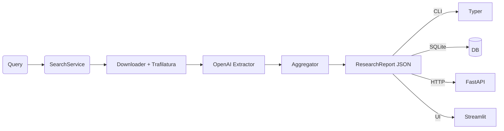

# GTMind — Autonomous Research Agent 🔎

> **From a single query to a structured, source‑linked research report.**  
> Searches the web → cleans articles → extracts insights with GPT‑4o → de‑duplicates & ranks → serves JSON, SQLite, CLI, and a Streamlit UI.

| CI | Coverage | Python | Docker | License |
|----|----------|--------|--------|---------|
|  |  | 3.11 | `ghcr.io/your-org/gtmind` | MIT |

---

## ✨ What’s inside?

| Layer | Module | Tech / Libs | Purpose |
|-------|--------|-------------|---------|
| **Search**      | `core/search.py`      | Serper.dev · `httpx`          | Google‑style search → URLs |
| **Parse**       | `core/parse.py`       | Async `httpx` · `trafilatura` | Download & boilerplate‑strip HTML |
| **Extract**     | `core/extract.py`     | OpenAI GPT‑4o · function‑calling | Pull trends, companies, gaps |
| **Aggregate**   | `core/aggregate.py`   | RapidFuzz · frequency rank    | De‑dupe & merge into a report |
| **Persist**     | `persistence.py`      | SQLite · `sqlmodel`           | `--save-sqlite` flag, history sidebar |
| **Serve**       | `api/run.py`          | FastAPI · Typer CLI           | `/report` JSON · `gtmind` CLI cmd |
| **UI**          | `ui/app.py`           | Streamlit                     | Query box, green gaps, saved list |
| **Tooling**     | Ruff · Mypy · Pytest  | 90 %+ coverage, pre‑commit hooks |
| **Deploy**      | Dockerfile            | Uvicorn + Streamlit           | One image → prod‑ready |

---

## 🖼 Architecture



---

## 🚀 Quick Start

```bash
git clone https://github.com/your-org/gtmind && cd gtmind
make install                                # poetry deps + tools
export OPENAI_API_KEY=sk-•••
export SEARCH_API_KEY=serp_•••
make serve &                                # FastAPI at :8000
make ui                                     # Streamlit at :8501
```

### CLI

```bash
gtmind "AI in retail" \
       --out retail.json \
       --save-sqlite reports.db
```

### API

```
GET http://localhost:8000/report?q=AI+in+retail
```

<details>
<summary>Response (JSON)</summary>

```json
{
  "query": "AI in retail",
  "trends": [
    {"text": "AI-driven demand forecasting", "sources": [...]}
  ],
  "companies": [
    {"name": "ForecastPro", "context": "", "sources": [...]}
  ],
  "whitespace_opportunities": [
    {"description": "Tier-2 retailers lack AI tools", "sources": [...]}
  ]
}
```
</details>

### UI

```
streamlit run src/gtmind/ui/app.py
```

* 2‑column companies  
* Green‑highlighted whitespace gaps  
* Sidebar of most‑recent reports (SQLite)

---

## 🐳 Docker

```bash
docker build -t gtmind .
docker run -p 8000:8000 -p 8501:8501 \
  -e OPENAI_API_KEY=$OPENAI_API_KEY \
  -e SEARCH_API_KEY=$SEARCH_API_KEY \
  gtmind serve
```

---

## 📂 Project Layout

```
src/gtmind/
├─ core/                # search, parse, extract, aggregate
├─ api/                 # FastAPI + Typer CLI
├─ ui/                  # Streamlit front‑end
├─ persistence.py       # SQLite helpers
├─ sample_outputs/      # example JSON reports
└─ tests/               # unit + integration
```

---

## 🛣 Future Roadmap

* 🔎 Vector cache of article embeddings for faster re‑runs  
* ✨ RAG enrichment for deeper summaries  
* 💾 Postgres adapter for multi‑user persistence  
* 🌐 OAuth‑guarded web UI & shareable URLs  
* 🤖 Scheduled cron search with email digests  

---

## 🤝 Contributing

```bash
make check   # ruff + mypy
make test    # pytest
```

Pull requests welcome — please keep CI green! 🎉

---

## 📜 License

[MIT](LICENSE)  
© 2025 Amrit Kochar & contributors
